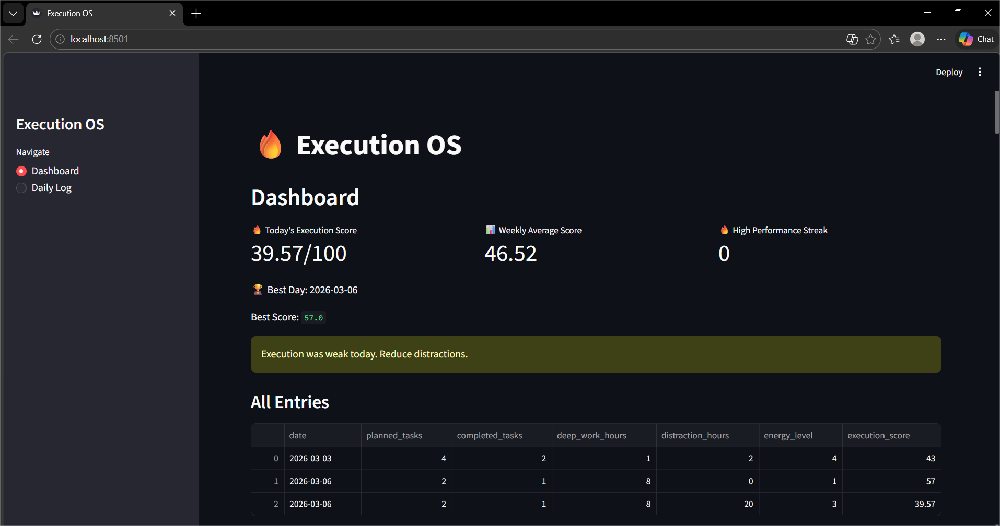

# 🔥 Execution OS

A personal productivity tracking system that helps you measure, analyze, and improve your daily execution performance using data.

---

## 🚀 Overview

**Execution OS** is a data-driven productivity dashboard built to track daily habits, focus, and performance.  
It converts your daily activities into measurable insights so you can improve consistency and reduce distractions.

---

## ✨ Features

- 📊 Execution Score System (out of 100)
- 📅 Daily Logging of tasks and activities
- ⏱️ Deep Work Tracking
- 🚫 Distraction Monitoring
- ⚡ Energy Level Tracking
- 📈 Weekly Performance Insights
- 🏆 Best Score & Streak Tracking

---

## 🖥️ Dashboard Preview



---

## 🧠 Execution Score Formula

Execution Score is calculated based on:

- Tasks Completed
- Deep Work Hours
- Distraction Time
- Energy Level

> Helps you objectively measure how productive your day was.

---

## 🛠️ Tech Stack

- **Python**
- **Streamlit**
- **Pandas**
- **Git & GitHub**

---

## 📂 Project Structure

```
Execution-OS/
│── data/                  # Stores logs (CSV)
│── screenshots/           # Dashboard images
│── app.py                 # Main Streamlit app
│── requirements.txt       # Dependencies
│── README.md              # Project documentation
```

---

## ⚙️ Installation & Setup

1. Clone the repository
```
git clone https://github.com/your-username/execution-os.git
```

2. Navigate to project folder
```
cd execution-os
```

3. Install dependencies
```
pip install -r requirements.txt
```

4. Run the app
```
streamlit run app.py
```

---

## 📊 How It Works

1. Enter your daily data:
   - Planned tasks
   - Completed tasks
   - Deep work hours
   - Distraction hours
   - Energy level

2. The system calculates your **Execution Score**

3. View:
   - Daily performance
   - Weekly average
   - Best score
   - Productivity trends

---

## 🎯 Use Case

- Students tracking study productivity  
- Developers maintaining discipline  
- Anyone building consistency & focus  

---

## 🔮 Future Improvements

- User authentication system  
- Cloud database integration  
- Advanced analytics & charts  
- Mobile-friendly UI  

---

## 🤝 Contributing

Feel free to fork this repo and improve it!

---

## 📌 Author

**Soumya Fernandez
